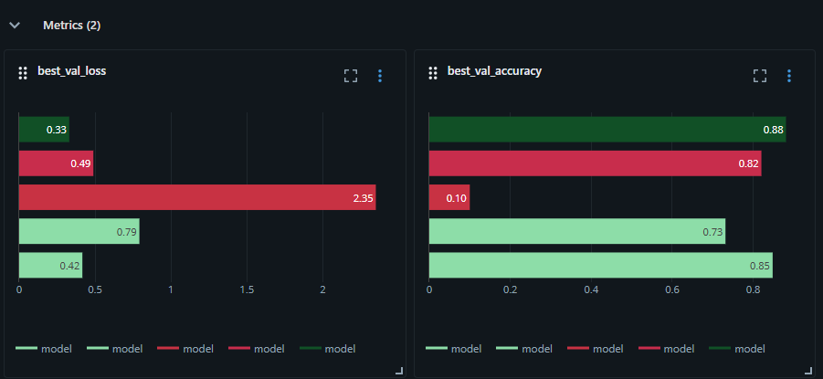
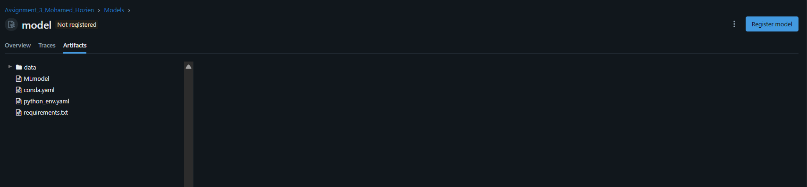
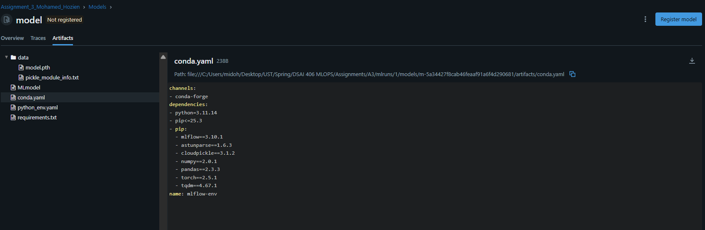
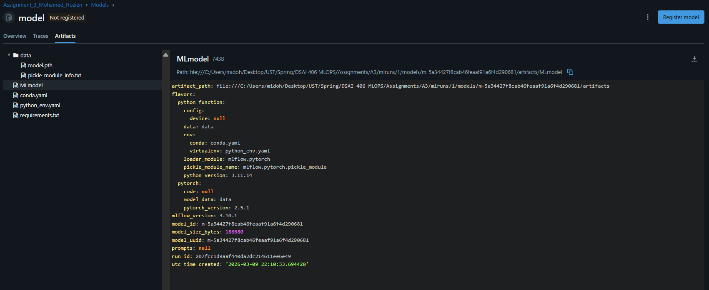
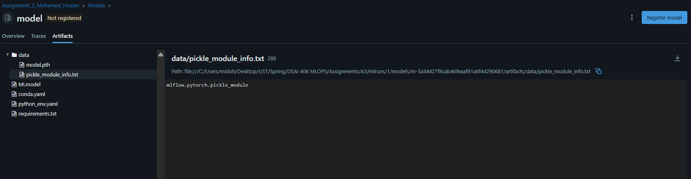
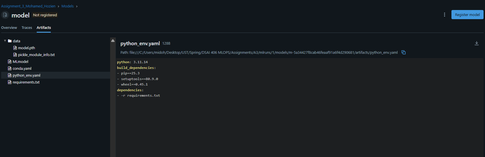
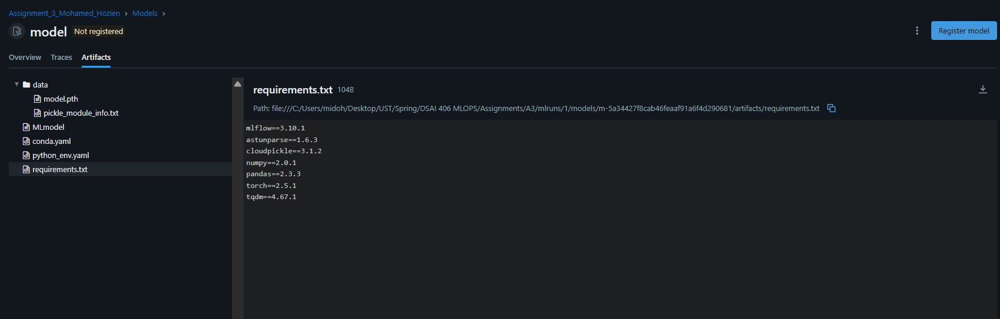

# Assignment 3 – MLflow Experiment Report

FashionMNIST Garment Classifier — Observable ML with MLflow

**Student:** Mohamed Hozien | **ID:** 202201507

---

## 1. Table View — All 5 Runs (Sorted by Best Val Accuracy)

| Rank | Run Name                  | LR    | Batch Size | Epochs | Best Val Accuracy | Best Val Loss |
| ---- | ------------------------- | ----- | ---------- | ------ | :---------------: | :-----------: |
| 1    | Run5_lr0.01_bs64_ep10     | 0.01  | 64         | 5      |    **0.8809**     |  **0.3295**   |
| 2    | Run1_baseline_lr0.001_bs4 | 0.001 | 4          | 1      |      0.8480       |    0.4163     |
| 3    | Run4_lr0.01_bs64          | 0.01  | 64         | 1      |      0.8202       |    0.4887     |
| 4    | Run2_lr0.01_bs4           | 0.01  | 4          | 1      |      0.7315       |    0.7920     |
| 5    | Run3_lr0.1_bs4            | 0.10  | 4          | 1      |      0.1000       |    2.3499     |

> All runs used: Optimizer = SGD, Momentum = 0.9, Loss = CrossEntropyLoss, Architecture = GarmentClassifier CNN.

---

## 2. Comparison View — Loss & Accuracy Across Runs

The chart below (from the MLflow UI) overlays `best_val_loss` and `best_val_accuracy` for all 5 runs:



**Key observations from the chart:**

- Run5 (dark green) achieves the lowest loss (0.33) and highest accuracy (0.88) — visible as the longest bar on the right in the accuracy chart.
- Run3 (bright red) dominates the loss chart in the worst direction (2.35), confirming training divergence due to an excessively high learning rate.
- Run1 (light green, 0.85 accuracy / 0.42 loss) outperforms Run2, Run3, and Run4, showing that a lower LR (0.001) is more stable for small batches.
- Run4 and Run5 share the same LR and batch size; the only difference is epochs (1 vs 5), yet accuracy jumps from 0.82 → 0.88, demonstrating that more training epochs significantly help convergence.

---

## 3. Artifact Gallery

The screenshots below show the saved artifacts from the MLflow UI:









**Artifacts logged per run:**
| Artifact | Description |
|----------|-------------|
| `best_model.pth` | PyTorch state dict of the lowest-val-loss checkpoint (177.16 KB) |
| `model/` | Full MLflow PyTorch model flavor directory |
| `MLmodel` | MLflow model metadata (flavors, python version, requirements) |
| `conda.yaml` / `requirements.txt` | Auto-generated environment reproduction files |
| `python_env.yaml` | Python environment spec generated by MLflow |

Artifact path example (Run 1):

```
file:///C:/Users/midoh/Desktop/UST/Spring/DSAI 406 MLOPS/Assignments/A3/mlruns/1/c8d1ea197c9f4ab393f65d5bfbabba99/artifacts/best_model.pth
```

---

## 4. Short Analysis

### Winner: Run5 — `lr=0.01, batch_size=64, epochs=5`

**Run5** is the clear winner with:

- **Best Val Accuracy: 88.09%**
- **Best Val Loss: 0.3295**

The combination of a moderate learning rate (0.01), a larger batch size (64), and sufficient training epochs (5) allowed the model to converge to a strong solution. More epochs gave the optimizer time to escape local minima and refine the weights, which is the primary reason Run5 outperforms all single-epoch runs.

---

### Overfitting / Underfitting Evidence

| Run                                       | Observation                                                                                                         | Diagnosis                                                                                                                                                                          |
| ----------------------------------------- | ------------------------------------------------------------------------------------------------------------------- | ---------------------------------------------------------------------------------------------------------------------------------------------------------------------------------- |
| Run3 (lr=0.1)                             | Val accuracy stuck at 10% (random chance for 10 classes); loss ~2.35 throughout all batches                         | **Severe underfitting / training divergence** — LR is too large; gradients explode and the model never learns.                                                                     |
| Run2 (lr=0.01, bs=4)                      | Val accuracy 73.15%, notably worse than Run1 (lr=0.001, bs=4)                                                       | **Mild underfitting** — LR of 0.01 with small batch size causes noisy gradient updates; the model does not converge as well.                                                       |
| Run4 vs Run5 (same config, 1 vs 5 epochs) | Run4: 82.02% → Run5: 88.09%                                                                                         | **Underfitting in Run4** — 1 epoch is insufficient for batch_size=64; more passes over the data are needed.                                                                        |
| Run5                                      | Train loss and val loss remain close across all 5 epochs (val_loss trending down: 0.44 → 0.38 → 0.36 → 0.34 → 0.33) | **No evidence of overfitting** — the gap between training and validation loss is small and val loss continues to decrease, suggesting more epochs could still improve performance. |
| Run1 (lr=0.001, bs=4)                     | Best single-epoch run (84.8%) but train_batch_loss and val_loss are very close                                      | **Healthy convergence** — lower LR with small batches gives stable but slow learning; the model would likely improve with more epochs.                                             |

---

### Summary of Hyperparameter Insights

1. **Learning Rate** is the most critical hyperparameter: lr=0.001 was stable, lr=0.01 needed larger batches to work well, and lr=0.1 caused complete divergence.
2. **Batch Size** alone is not decisive: increasing batch size from 4 → 64 at lr=0.01 slightly hurt single-epoch performance (Run2: 73% → Run4: 82%) but enabled much better multi-epoch training.
3. **Epochs** had the largest positive impact: going from 1 → 5 epochs (Run4 → Run5) improved accuracy by ~6.5 percentage points with no signs of overfitting.
4. **Best strategy**: moderate LR + larger batch size + more epochs, as demonstrated by Run5.
